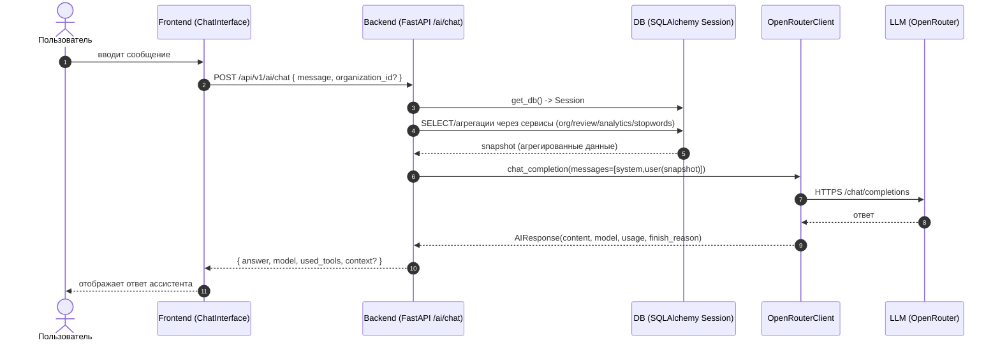

# Курсовая: код ИИ‑агента и его взаимодействие с БД

Ниже собран **весь код**, который непосредственно отвечает за:

1) **ИИ‑агента, взаимодействующего с пользователем** (UI чата + HTTP API + формирование промптов + вызов LLM).
2) **Взаимодействие ИИ‑агента с базой данных** (инициализация БД, сессии, выборки/агрегации данных, которые передаются в LLM как контекст).

> Термины:
> - **LLM**: модель, вызываемая через OpenRouter.
> - **snapshot/контекст**: агрегированные данные из БД, которые подмешиваются в промпт.

---

## Общая схема (архитектурно)

```mermaid
flowchart LR
  U[Пользователь] --> F[Frontend: Chat UI]
  F -->|HTTP POST /api/v1/ai/chat| API[FastAPI router ai_chat]
  API -->|Depends(get_db)| DB[(SQL DB)]
  API --> S1[OrganizationService]
  API --> S2[ReviewService]
  API --> S3[AnalyticsService]
  API --> S4[StopWordsService]
  S1 --> DB
  S2 --> DB
  S3 --> DB
  S4 --> DB
  API -->|messages| OR[OpenRouterClient]
  OR -->|HTTPS| LLM[(OpenRouter / LLM)]
  LLM --> OR --> API --> F --> U
```

---

## Схема взаимодействия (sequence)



---

## Важное наблюдение по реализации “агента”

В репозитории есть **два уровня AI‑логики**:

- **HTTP‑чат `/api/v1/ai/chat`** реализует “агента” как **построение `snapshot` из БД + вызов `OpenRouterClient.chat_completion`**. Это фактически основной пользовательский “агент” (потому что именно он отвечает в чате).
- Есть отдельный класс **`AIAgent`** (`backend/src/core/ai/agent.py`) и обёртка **`AIService`** (`backend/src/services/ai.py`) — они применяются для “внутренних” AI‑задач (например, анализ тональности, генерация инсайтов), но **чатовый endpoint** вызывает OpenRouter напрямую, используя client, доставшийся из `app.state`.

---

## 1) Код: взаимодействие ИИ‑агента с пользователем

### 1.1 Frontend: UI чата

Файл `frontend/src/components/Dashboard/ChatInterface/ChatInterface.js`:

```1:418:frontend/src/components/Dashboard/ChatInterface/ChatInterface.js
import React, { useState, useEffect, useRef } from 'react';
import {
  Box,
  Typography,
  Paper,
  TextField,
  IconButton,
  Stack,
  Avatar,
  Chip,
  LinearProgress,
  Tooltip,
} from '@mui/material';
import SmartToyIcon from '@mui/icons-material/SmartToy';
import SendIcon from '@mui/icons-material/Send';
import PersonIcon from '@mui/icons-material/Person';
import SearchIcon from '@mui/icons-material/Search';
import InsightsIcon from '@mui/icons-material/Insights';
import AssessmentIcon from '@mui/icons-material/Assessment';
import CheckCircleIcon from '@mui/icons-material/CheckCircle';
import RadioButtonUncheckedIcon from '@mui/icons-material/RadioButtonUnchecked';
import CircularProgress from '@mui/material/CircularProgress';

import { aiChat } from '../../../services/adminService';

/**
 * Сообщение в чате AI.
 */
const initialAssistantMessage = {
  id: 'welcome',
  role: 'assistant',
  content:
    'Здравствуйте! Я AI‑ассистент системы анализа отзывов об образовательных организациях Нижегородской области. ' +
    'Могу подсказать по статистике, помочь сформировать отчёт или найти проблемные учреждения по отзывам. Чем могу помочь?',
  timestamp: new Date(),
};

const operationPresets = [
  {
    id: 'search',
    type: 'search',
    label: 'Поиск и агрегация данных в базе',
    icon: SearchIcon,
  },
  {
    id: 'analysis',
    type: 'analysis',
    label: 'Аналитика и интерпретация показателей',
    icon: InsightsIcon,
  },
  {
    id: 'report',
    type: 'report',
    label: 'Формирование ответа и отчёта',
    icon: AssessmentIcon,
  },
];

export default function ChatInterface() {
  const [messages, setMessages] = useState([initialAssistantMessage]);
  const [input, setInput] = useState('');
  const [isSending, setIsSending] = useState(false);
  const [operations, setOperations] = useState([]);
  const [error, setError] = useState('');
  const scrollRef = useRef(null);

  useEffect(() => {
    if (scrollRef.current) {
      scrollRef.current.scrollTop = scrollRef.current.scrollHeight;
    }
  }, [messages, operations]);

  const startOperationsAnimation = () => {
    // Клонируем шаблон операций со статусом pending
    const ops = operationPresets.map((op) => ({
      ...op,
      status: 'pending',
    }));
    setOperations(ops);

    // Пошаговая анимация статусов
    ops.forEach((op, index) => {
      setTimeout(() => {
        setOperations((prev) =>
          prev.map((o) =>
            o.id === op.id ? { ...o, status: 'active' } : o
          ),
        );
      }, index * 700);

      setTimeout(() => {
        setOperations((prev) =>
          prev.map((o) =>
            o.id === op.id ? { ...o, status: 'complete' } : o
          ),
        );
      }, (index + 1) * 700);
    });
  };

  const handleSend = async () => {
    if (!input.trim() || isSending) return;

    setError('');
    const text = input.trim();
    setInput('');

    const userMessage = {
      id: `user-${Date.now()}`,
      role: 'user',
      content: text,
      timestamp: new Date(),
    };
    setMessages((prev) => [...prev, userMessage]);
    setIsSending(true);

    // Запускаем визуализацию операций
    startOperationsAnimation();

    try {
      const response = await aiChat({ message: text });

      setOperations([]); // убираем панель операций после ответа
      const assistantMessage = {
        id: `assistant-${Date.now()}`,
        role: 'assistant',
        content: response.answer || 'Ответ не получен от AI‑сервиса.',
        timestamp: new Date(),
      };
      setMessages((prev) => [...prev, assistantMessage]);
    } catch (e) {
      setOperations([]);
      setError('Не удалось связаться с AI‑ассистентом. Проверьте подключение к серверу.');
    } finally {
      setIsSending(false);
    }
  };

  const renderMessage = (message) => (
    <Box
      key={message.id}
      sx={{
        display: 'flex',
        mb: 1.5,
        flexDirection: message.role === 'user' ? 'row-reverse' : 'row',
        alignItems: 'flex-start',
        gap: 1,
      }}
    >
      <Avatar
        sx={{
          bgcolor: message.role === 'assistant' ? 'primary.light' : 'grey.200',
          color: message.role === 'assistant' ? 'primary.main' : 'text.primary',
          width: 32,
          height: 32,
        }}
      >
        {message.role === 'assistant' ? (
          <SmartToyIcon fontSize="small" />
        ) : (
          <PersonIcon fontSize="small" />
        )}
      </Avatar>
      <Box
        sx={{
          maxWidth: '75%',
          p: 1.5,
          borderRadius: 2,
          bgcolor:
            message.role === 'assistant'
              ? 'grey.100'
              : 'primary.main',
          color:
            message.role === 'assistant'
              ? 'text.primary'
              : 'primary.contrastText',
        }}
      >
        <Typography variant="body2" sx={{ whiteSpace: 'pre-wrap' }}>
          {message.content}
        </Typography>
        <Typography
          variant="caption"
          sx={{
            display: 'block',
            mt: 0.5,
            color:
              message.role === 'assistant'
                ? 'text.secondary'
                : 'primary.light',
          }}
        >
          {message.timestamp.toLocaleTimeString('ru-RU', {
            hour: '2-digit',
            minute: '2-digit',
          })}
        </Typography>
      </Box>
    </Box>
  );

  const renderOperations = () => {
    if (!operations.length) return null;

    return (
      <Box
        sx={{
          mt: 1.5,
          p: 1.5,
          borderRadius: 2,
          bgcolor: 'primary.50',
          border: '1px solid',
          borderColor: 'primary.light',
        }}
      >
        <Stack direction="row" spacing={1} alignItems="center" mb={1}>
          <SmartToyIcon fontSize="small" color="primary" />
          <Typography variant="caption" color="primary">
            Ассистент обрабатывает запрос…
          </Typography>
        </Stack>
        <Stack spacing={1}>
          {operations.map((op) => {
            const Icon = op.icon;
            const isActive = op.status === 'active';
            const isComplete = op.status === 'complete';

            return (
              <Box
                key={op.id}
                sx={{ display: 'flex', alignItems: 'center', gap: 1 }}
              >
                {isComplete ? (
                  <CheckCircleIcon
                    fontSize="small"
                    color="success"
                  />
                ) : isActive ? (
                  <CircularProgress size={16} />
                ) : (
                  <RadioButtonUncheckedIcon
                    fontSize="small"
                    color="disabled"
                  />
                )}
                <Icon
                  fontSize="small"
                  color={isComplete ? 'action' : 'disabled'}
                />
                <Typography
                  variant="body2"
                  sx={{
                    textDecoration: isComplete ? 'line-through' : 'none',
                    color: isComplete ? 'text.secondary' : 'text.primary',
                  }}
                >
                  {op.label}
                </Typography>
              </Box>
            );
          })}
        </Stack>
      </Box>
    );
  };

  const renderTypingIndicator = () => {
    if (!isSending) return null;
    return (
      <Box sx={{ display: 'flex', alignItems: 'center', mt: 1 }}>
        <Avatar
          sx={{
            bgcolor: 'primary.light',
            color: 'primary.main',
            width: 28,
            height: 28,
            mr: 1,
          }}
        >
          <SmartToyIcon fontSize="small" />
        </Avatar>
        <Box
          sx={{
            display: 'flex',
            gap: 0.5,
            p: 0.75,
            borderRadius: 2,
            bgcolor: 'grey.100',
          }}
        >
          <Box
            sx={{
              width: 6,
              height: 6,
              borderRadius: '50%',
              bgcolor: 'grey.500',
              animation: 'typingDot 1s infinite ease-in-out',
            }}
          />
          <Box
            sx={{
              width: 6,
              height: 6,
              borderRadius: '50%',
              bgcolor: 'grey.500',
              animation: 'typingDot 1s infinite ease-in-out',
              animationDelay: '0.2s',
            }}
          />
          <Box
            sx={{
              width: 6,
              height: 6,
              borderRadius: '50%',
              bgcolor: 'grey.500',
              animation: 'typingDot 1s infinite ease-in-out',
              animationDelay: '0.4s',
            }}
          />
        </Box>
      </Box>
    );
  };

  return (
    <Paper variant="outlined" sx={{ p: 3, minHeight: 320, display: 'flex', flexDirection: 'column' }}>
      <Box sx={{ display: 'flex', alignItems: 'center', gap: 1, mb: 1 }}>
        <SmartToyIcon color="primary" />
        <Typography variant="h6" fontWeight="bold">
          AI‑ассистент
        </Typography>
        <Chip
          label="Онлайн"
          color="success"
          size="small"
          sx={{ ml: 'auto' }}
        />
      </Box>
      <Typography variant="body2" color="text.secondary" sx={{ mb: 1 }}>
        Задайте вопрос об организациях, отзывах или попросите сформировать управленческий отчёт.
      </Typography>

      {isSending && (
        <LinearProgress
          sx={{ mb: 1 }}
          aria-label="AI is processing the request"
        />
      )}

      <Box
        ref={scrollRef}
        sx={{
          flex: 1,
          overflowY: 'auto',
          borderRadius: 1,
          border: '1px solid',
          borderColor: 'divider',
          p: 1.5,
          mb: 1.5,
          bgcolor: 'background.default',
        }}
      >
        {messages.map(renderMessage)}
        {renderOperations()}
        {renderTypingIndicator()}
      </Box>

      {error && (
        <Typography
          variant="caption"
          color="error"
          sx={{ mb: 0.5 }}
        >
          {error}
        </Typography>
      )}

      <Box sx={{ display: 'flex', alignItems: 'center', gap: 1 }}>
        <TextField
          fullWidth
          size="small"
          placeholder="Например: «Сделай сводный отчёт по школам с наибольшим количеством негативных отзывов»"
          value={input}
          onChange={(e) => setInput(e.target.value)}
          onKeyDown={(e) => {
            if (e.key === 'Enter' && !e.shiftKey) {
              e.preventDefault();
              handleSend();
            }
          }}
          disabled={isSending}
        />
        <Tooltip title="Отправить">
          <span>
            <IconButton
              color="primary"
              onClick={handleSend}
              disabled={isSending || !input.trim()}
            >
              <SendIcon />
            </IconButton>
          </span>
        </Tooltip>
      </Box>

      {/* Анимация точек (keyframes) */}
      <style>
        {`
          @keyframes typingDot {
            0%, 80%, 100% { transform: scale(0.7); opacity: 0.5; }
            40% { transform: scale(1); opacity: 1; }
          }
        `}
      </style>
    </Paper>
  );
}
```

### 1.2 Frontend: API‑клиент для чата

Файл `frontend/src/services/aiApi.ts`:

```1:21:frontend/src/services/aiApi.ts
import api from './authService';

export interface AIChatRequest {
  message: string;
  organization_id?: number;
  return_context?: boolean;
}

export interface AIChatResponse {
  answer: string;
  model: string;
  used_tools: string[];
  context?: Record<string, unknown> | null;
}

export const aiApi = {
  chat: (body: AIChatRequest) =>
    api.post<AIChatResponse>('/ai/chat', body).then((r) => r.data),
};
```

---

## 2) Код: backend‑агент (чат) + вызов LLM

### 2.1 Router: `/api/v1/ai/chat` и `/api/v1/ai/report`

Файл `backend/src/api/v1/routers/ai_chat.py`:

```1:261:backend/src/api/v1/routers/ai_chat.py
"""
AI chat and reporting router for API v1.

Маршрутизатор для диалога с AI-ассистентом и генерации текстовых отчётов.
Ассистент использует агрегированные данные из БД (организации, отзывы,
аналитика, стоп-слова), но наружу отдаёт только текст и, опционально,
краткое описание использованных инструментов.
"""

from datetime import datetime, timedelta, date
from typing import Dict, Any, List

from fastapi import APIRouter, Depends, HTTPException, status
from sqlalchemy.orm import Session

from src.database.session import get_db
from src.app.dependencies import (
    get_current_user,
    get_openrouter_client,
)
from src.models.user import User
from src.models.user import UserRole
from src.services.organization import OrganizationService
from src.services.review import ReviewService
from src.services.analytics import AnalyticsService
from src.services.stopwords import StopWordsService
from src.core.ai.openrouter import OpenRouterClient
from src.schemas.ai import (
    AIChatRequest,
    AIChatResponse,
    AIReportRequest,
    AIReportResponse,
)


router = APIRouter()


def _build_db_snapshot(db: Session, organization_id: int | None) -> Dict[str, Any]:
    """
    Сбор сводной информации из базы данных для AI-ассистента.

    Это внутренние "инструменты" агента:
    - статистика по организациям;
    - статистика по отзывам;
    - статистика по аналитике;
    - статистика по стоп-словам;
    - топ организаций и несколько свежих отзывов.
    """
    tools_used: List[str] = []

    org_service = OrganizationService(db, ai_service=None)
    review_service = ReviewService(db, ai_service=None)
    analytics_service = AnalyticsService(db, ai_service=None)
    stopwords_service = StopWordsService(db, ai_service=None)

    snapshot: Dict[str, Any] = {}

    # Организации
    try:
        snapshot["organization_stats"] = org_service.get_organization_statistics().dict()
        tools_used.append("organization_statistics")
        snapshot["top_organizations"] = [
            o.to_dict() for o in org_service.get_top_organizations(limit=10)
        ]
        tools_used.append("top_organizations")
    except Exception:
        snapshot["organization_stats_error"] = "failed"

    # Отзывы
    try:
        snapshot["review_stats"] = review_service.get_review_statistics(
            organization_id
        ).dict()
        tools_used.append("review_statistics")
    except Exception:
        snapshot["review_stats_error"] = "failed"

    # Аналитика
    try:
        snapshot["analytics_stats"] = analytics_service.get_analytics_statistics().dict()
        tools_used.append("analytics_statistics")
    except Exception:
        snapshot["analytics_stats_error"] = "failed"

    # Стоп-слова
    try:
        snapshot["stopwords_stats"] = stopwords_service.get_stopwords_statistics().dict()
        tools_used.append("stopwords_statistics")
    except Exception:
        snapshot["stopwords_stats_error"] = "failed"

    # Несколько последних отзывов для примеров
    try:
        from src.schemas.review import ReviewSearch

        recent_reviews = review_service.search_reviews(
            ReviewSearch(
                query=None,
                organization_id=organization_id,
                rating=None,
                status=None,
                sentiment=None,
                source=None,
                is_approved=True,
                author_name=None,
                min_date=None,
                max_date=None,
                skip=0,
                limit=20,
            )
        )
        snapshot["recent_reviews"] = [
            {
                "id": r.id,
                "organization_id": r.organization_id,
                "rating": r.rating,
                "sentiment": r.sentiment.value if r.sentiment else None,
                "text": r.text,
                "review_date": r.review_date.isoformat() if r.review_date else None,
            }
            for r in recent_reviews
        ]
        tools_used.append("recent_reviews")
    except Exception:
        snapshot["recent_reviews_error"] = "failed"

    snapshot["used_tools"] = tools_used
    snapshot["generated_at"] = datetime.utcnow().isoformat()
    return snapshot


@router.post("/chat", response_model=AIChatResponse)
async def ai_chat(
    body: AIChatRequest,
    db: Session = Depends(get_db),
    current_user: User = Depends(get_current_user),
    openrouter_client: OpenRouterClient | None = Depends(get_openrouter_client),
):
    """
    Диалог с AI-ассистентом.

    Ассистент:
    - видит агрегированные данные из базы (без персональных данных пользователей);
    - отвечает по-русски;
    - даёт понятные выводы и управленческие рекомендации.
    """
    if openrouter_client is None:
        raise HTTPException(
            status_code=status.HTTP_503_SERVICE_UNAVAILABLE,
            detail="AI service is not configured",
        )

    snapshot = _build_db_snapshot(db, body.organization_id)
    tools_used = snapshot.get("used_tools", [])

    system_prompt = (
        "Ты — аналитический AI-ассистент Министерства образования Нижегородской области. "
        "У тебя есть агрегированные данные по организациям образования, отзывам, аналитике и стоп-словам. "
        "Отвечай строго на русском языке, деловым, но понятным стилем. "
        "Если вопрос про конкретную организацию — используй доступные метрики и отзывы именно по ней. "
        "Всегда структурируй ответ: краткое резюме, ключевые выводы. "
        "Не давай рекомендаций. "
        "Если уместно, оформляй ответ в Markdown (заголовки, списки), но без громоздких таблиц."
    )

    user_content = (
        f"Вопрос пользователя:\n{body.message}\n\n"
        "Данные из базы (JSON, агрегированные, без персональных данных пользователей):\n"
        f"{snapshot}\n\n"
        "Сформируй ответ, опираясь на эти данные. Если информации недостаточно, прямо укажи, "
        "чего не хватает, и предложи, какие дополнительные данные нужны."
    )

    messages = [
        {"role": "system", "content": system_prompt},
        {"role": "user", "content": user_content},
    ]

    try:
        response = openrouter_client.chat_completion(
            messages=messages,
            model=openrouter_client.model,
            temperature=0.2,
            max_tokens=1500,
        )
    except Exception as e:
        raise HTTPException(
            status_code=status.HTTP_502_BAD_GATEWAY,
            detail=f"AI service error: {e}",
        )

    return AIChatResponse(
        answer=response.content,
        model=response.model,
        used_tools=tools_used,
        context=snapshot if body.return_context else None,
    )


@router.post("/report", response_model=AIReportResponse)
async def ai_report(
    body: AIReportRequest,
    db: Session = Depends(get_db),
    current_user: User = Depends(get_current_user),
    openrouter_client: OpenRouterClient | None = Depends(get_openrouter_client),
):
    """
    Сгенерировать аналитический отчёт с помощью AI.

    Используется комбинация:
    - AnalyticsService для получения структурированных метрик;
    - OpenRouter (модель Trinity) для преобразования метрик в человеко-читаемый отчёт.
    """
    if current_user.role not in (UserRole.ADMIN, UserRole.MODERATOR):
        raise HTTPException(
            status_code=status.HTTP_403_FORBIDDEN,
            detail="Недостаточно прав для генерации отчёта",
        )

    if openrouter_client is None:
        raise HTTPException(
            status_code=status.HTTP_503_SERVICE_UNAVAILABLE,
            detail="AI service is not configured",
        )

    # Диапазон дат по умолчанию — последние 30 дней
    end_dt: date = body.end_date or datetime.utcnow().date()
    start_dt: date = body.start_date or (end_dt - timedelta(days=30))

    analytics_service = AnalyticsService(db, ai_service=None)

    # Собираем структурированные данные для отчёта
    report_data = analytics_service.generate_report(
        report_type=body.report_type,
        start_date=datetime.combine(start_dt, datetime.min.time()),
        end_date=datetime.combine(end_dt, datetime.max.time()),
        org_id=body.organization_id,
    )

    # Просим модель оформить текстовый отчёт
    try:
        report_markdown = openrouter_client.generate_report(
            data=report_data,
            report_type="analytics",
            format=body.format,
        )
    except Exception as e:
        raise HTTPException(
            status_code=status.HTTP_502_BAD_GATEWAY,
            detail=f"AI service error while generating report: {e}",
        )

    return AIReportResponse(
        report_markdown=report_markdown,
        report_type=body.report_type,
        model=openrouter_client.model,
        data=report_data,
    )
```

### 2.2 Pydantic схемы чата/отчёта

Файл `backend/src/schemas/ai.py`:

```1:85:backend/src/schemas/ai.py
"""
AI schemas for NN MinObr AI.

Схемы запросов/ответов для чата с ИИ и генерации отчётов.
"""

from typing import Optional, List, Dict, Any
from datetime import date

from pydantic import BaseModel, Field


class AIChatRequest(BaseModel):
    """Запрос на диалог с AI-ассистентом."""

    message: str = Field(
        ...,
        description="Сообщение пользователя (вопрос или задание для ассистента)",
    )
    organization_id: Optional[int] = Field(
        None,
        description="ID организации, если запрос относится к конкретному учреждению",
    )
    return_context: bool = Field(
        False,
        description="Вернуть ли в ответе агрегированный контекст из БД (для отладки)",
    )


class AIChatResponse(BaseModel):
    """Ответ AI-ассистента."""

    answer: str = Field(..., description="Текстовый ответ ассистента (Markdown)")
    model: str = Field(..., description="Имя использованной модели")
    used_tools: List[str] = Field(
        default_factory=list,
        description="Список внутренних инструментов, использованных для подготовки ответа",
    )
    context: Optional[Dict[str, Any]] = Field(
        None,
        description="Агрегированный контекст из БД (если запрошено return_context=true)",
    )


class AIReportRequest(BaseModel):
    """Запрос на генерацию аналитического отчёта."""

    report_type: str = Field(
        "comprehensive",
        description=(
            "Тип отчёта: organization, review, user, comprehensive "
            "(по умолчанию комплексный отчёт)"
        ),
    )
    organization_id: Optional[int] = Field(
        None,
        description="ID организации (для отчётов по конкретному учреждению)",
    )
    start_date: Optional[date] = Field(
        None,
        description="Начало периода (если не указано — последние 30 дней)",
    )
    end_date: Optional[date] = Field(
        None,
        description="Конец периода (если не указано — сегодня)",
    )
    format: str = Field(
        "markdown",
        description="Формат текстового отчёта: markdown или text",
    )


class AIReportResponse(BaseModel):
    """Ответ с готовым аналитическим отчётом."""

    report_markdown: str = Field(
        ..., description="Готовый отчёт (чаще всего в формате Markdown)"
    )
    report_type: str = Field(..., description="Тип отчёта")
    model: str = Field(..., description="Имя использованной модели")
    data: Dict[str, Any] = Field(
        ..., description="Структурированные исходные данные отчёта из БД"
    )
```

### 2.3 Клиент OpenRouter (вызов LLM)

Файл `backend/src/core/ai/openrouter.py`:

```1:372:backend/src/core/ai/openrouter.py
"""
OpenRouter API client for NN MinObr AI.

This module provides a client for interacting with OpenRouter API
to perform AI-powered analysis and report generation.
"""

import requests
import json
from typing import Dict, List, Any, Optional, AsyncGenerator
from dataclasses import dataclass
from ..exceptions import AIException


@dataclass
class AIResponse:
    """Структура данных ответа AI."""
    content: str
    model: str
    usage: Dict[str, int]
    finish_reason: str


class OpenRouterClient:
    """OpenRouter API клиент."""
    
    def __init__(self, api_key: str, model: str = "arcee-ai/trinity-large-preview:free", base_url: str = "https://openrouter.ai/api/v1"):
        """
        Инициализация OpenRouter клиента.
        
        Args:
            api_key: OpenRouter API ключ
            model: Используемая AI модель
            base_url: OpenRouter API базовый URL
        """
        self.api_key = api_key
        # Основная модель по умолчанию (может переопределяться через Settings.OPENROUTER_MODEL)
        self.model = model
        self.base_url = base_url
        self.headers = {
            "Authorization": f"Bearer {api_key}",
            "Content-Type": "application/json",
            "HTTP-Referer": "http://localhost:8080",
            "X-Title": "NN MinObr AI"
        }
    
    async def test_connection(self) -> bool:
        """
        Тестирование соединения с OpenRouter API.
        
        Returns:
            True если соединение успешно, иначе False
        """
        if not self.api_key:
            # Если API ключ не задан, считаем соединение неуспешным
            return False
            
        try:
            # Простой тестовый запрос для проверки соединения
            messages = [
                {
                    "role": "user",
                    "content": "Hello, please respond with 'ok' to confirm the connection works."
                }
            ]
            
            response = self.chat_completion(
                messages=messages,
                model=self.model,
                temperature=0.0,
                max_tokens=10
            )
            
            return "ok" in response.content.lower()
            
        except Exception as e:
            print(f"Connection test failed: {e}")
            return False
    
    def chat_completion(
        self,
        messages: List[Dict[str, str]],
        model: str = "arcee-ai/trinity-large-preview:free",
        temperature: float = 0.7,
        max_tokens: Optional[int] = None,
        stream: bool = False
    ) -> AIResponse:
        """
        Получение ответа чата от OpenRouter.
        
        Args:
            messages: Список сообщений в диалоге
            model: Используемая AI модель
            temperature: Температура для случайности
            max_tokens: Максимальное количество генерируемых токенов
            stream: Потоковая передача ответа
            
        Returns:
            Ответ AI
            
        Raises:
            AIException: Если запрос к API не удался
        """
        try:
            payload = {
                "model": model,
                "messages": messages,
                "temperature": temperature
            }
            
            if max_tokens:
                payload["max_tokens"] = max_tokens
            
            if stream:
                return self._stream_completion(payload)
            else:
                return self._sync_completion(payload)
                
        except requests.RequestException as e:
            raise AIException(f"OpenRouter API request failed: {str(e)}", "openrouter")
        except Exception as e:
            raise AIException(f"Unexpected error in OpenRouter client: {str(e)}", "openrouter")
    
    def _sync_completion(self, payload: Dict[str, Any]) -> AIResponse:
        """Получение синхронного ответа."""
        response = requests.post(
            f"{self.base_url}/chat/completions",
            headers=self.headers,
            json=payload
        )
        
        if response.status_code != 200:
            raise AIException(
                f"OpenRouter API error: {response.status_code} - {response.text}",
                "openrouter"
            )
        
        data = response.json()
        
        return AIResponse(
            content=data["choices"][0]["message"]["content"],
            model=data["model"],
            usage=data.get("usage", {}),
            finish_reason=data["choices"][0]["finish_reason"]
        )
    
    def _stream_completion(self, payload: Dict[str, Any]) -> AIResponse:
        """Получение потокового ответа."""
        payload["stream"] = True
        
        response = requests.post(
            f"{self.base_url}/chat/completions",
            headers=self.headers,
            json=payload,
            stream=True
        )
        
        if response.status_code != 200:
            raise AIException(
                f"OpenRouter API error: {response.status_code} - {response.text}",
                "openrouter"
            )
        
        content = ""
        model = ""
        usage = {}
        finish_reason = ""
        
        for line in response.iter_lines():
            if line:
                line_str = line.decode('utf-8')
                if line_str.startswith("data: "):
                    data_str = line_str[6:]  # Remove "data: " prefix
                    if data_str.strip() == "[DONE]":
                        break
                    
                    try:
                        data = json.loads(data_str)
                        if "choices" in data and len(data["choices"]) > 0:
                            delta = data["choices"][0].get("delta", {})
                            if "content" in delta:
                                content += delta["content"]
                            if "model" in data:
                                model = data["model"]
                            if "usage" in data:
                                usage = data["usage"]
                            if "finish_reason" in data["choices"][0]:
                                finish_reason = data["choices"][0]["finish_reason"]
                    except json.JSONDecodeError:
                        continue
        
        return AIResponse(
            content=content,
            model=model,
            usage=usage,
            finish_reason=finish_reason
        )
    
    def generate_text(self, prompt: str, temperature: float = 0.3, max_tokens: int = 3000) -> Any:
        """
        Send a text prompt and return parsed JSON or raw text.

        This is a convenience wrapper around chat_completion intended for
        prompts that request a JSON-formatted answer.

        Args:
            prompt: The user prompt
            temperature: Sampling temperature
            max_tokens: Max tokens for the response

        Returns:
            Parsed JSON (dict/list) if the response is valid JSON,
            otherwise the raw response string.
        """
        messages = [
            {
                "role": "system",
                "content": (
                    "You are an AI assistant specialized in analyzing educational data. "
                    "Always respond with valid JSON when asked for structured output."
                )
            },
            {"role": "user", "content": prompt}
        ]

        response = self.chat_completion(
            messages=messages,
            model=self.model,
            temperature=temperature,
            max_tokens=max_tokens,
        )

        try:
            return json.loads(response.content)
        except json.JSONDecodeError:
            return response.content

    def generate_report(
        self,
        data: Dict[str, Any],
        report_type: str = "analytics",
        format: str = "markdown"
    ) -> str:
        """
        Генерация AI-отчета.
        
        Args:
            data: Данные для анализа
            report_type: Тип отчета (аналитика, сводка, аналитика)
            format: Формат вывода (markdown, html, text)
            
        Returns:
            Сгенерированный отчет
            
        Raises:
            AIException: Если генерация отчета не удалась
        """
        prompt = self._build_report_prompt(data, report_type, format)
        
        messages = [
            {
                "role": "system",
                "content": "You are an AI assistant for the Ministry of Education of Nizhny Novgorod Region. You analyze organizations, reviews and analytics data and generate clear, structured reports for officials. Focus on Russian language, formal but understandable style, and provide only concise, factual information without recommendations."
            },
            {
                "role": "user",
                "content": prompt
            }
        ]
        
        response = self.chat_completion(
            messages=messages,
            model=self.model,
            temperature=0.3,
            max_tokens=4000
        )
        
        return response.content
    
    def analyze_sentiment(self, text: str) -> Dict[str, float]:
        """
        Анализ тональности текста.
        
        Args:
            text: Текст для анализа
            
        Returns:
            Результаты анализа тональности
            
        Raises:
            AIException: Если анализ тональности не удался
        """
        prompt = f"""
        Analyze the sentiment of the following text about an educational institution:
        
        "{text}"
        
        Provide the analysis in JSON format with the following structure:
        {{
            "sentiment": "positive|negative|neutral",
            "score": 0.0-1.0,
            "confidence": 0.0-1.0,
            "keywords": ["keyword1", "keyword2", ...],
            "reasoning": "Brief explanation of the sentiment"
        }}
        """
        
        messages = [
            {
                "role": "system",
                "content": "You are an AI assistant specialized in sentiment analysis of Russian-language educational reviews for the Ministry of Education of Nizhny Novgorod Region. Return precise JSON as requested."
            },
            {
                "role": "user",
                "content": prompt
            }
        ]
        
        response = self.chat_completion(
            messages=messages,
            model=self.model,
            temperature=0.1,
            max_tokens=1000
        )
        
        try:
            return json.loads(response.content)
        except json.JSONDecodeError:
            raise AIException("Failed to parse sentiment analysis response", "openrouter")
    
    def _build_report_prompt(self, data: Dict[str, Any], report_type: str, format: str) -> str:
        """Создание промпта для генерации отчета."""
        if report_type == "analytics":
            return f"""
            Generate a comprehensive analytics report based on the following educational data:
            
            {json.dumps(data, indent=2)}
            
            The report should include:
            1. Executive summary
            2. Key metrics and statistics
            3. Trends and patterns
            4. Insights
            
            Format the report in {format} format.
            """
        elif report_type == "summary":
            return f"""
            Generate a concise summary of the following educational data:
            
            {json.dumps(data, indent=2)}
            
            Focus on the most important findings and key takeaways.
            Format the summary in {format} format.
            """
        elif report_type == "insights":
            return f"""
            Generate detailed insights and analysis based on the following educational data:
            
            {json.dumps(data, indent=2)}
            
            Provide deep analysis and identify patterns.
            Format the insights in {format} format.
            """
        else:
            return f"""
            Generate a report based on the following data:
            
            {json.dumps(data, indent=2)}
            
            Format the report in {format} format.
            """
```

### 2.4 “Агент” как класс (используется сервисом, не самим `/ai/chat`)

Файл `backend/src/core/ai/agent.py`:

```1:355:backend/src/core/ai/agent.py
"""
AI Agent for NN MinObr AI.

This module provides an AI agent that can analyze educational data,
generate reports, and provide insights using OpenRouter API.
"""

from typing import Dict, List, Any, Optional
from dataclasses import dataclass
from ..ai.openrouter import OpenRouterClient, AIResponse
from ..exceptions import AIException
import json


@dataclass
class AnalysisResult:
    """Структура данных результата анализа."""
    summary: str
    insights: List[str]
    recommendations: List[str]
    sentiment: Dict[str, float]
    trends: List[str]


class AIAgent:
    """AI агент для анализа образовательных данных."""
    
    def __init__(self, openrouter_client: OpenRouterClient):
        """
        Инициализация AI агента.
        
        Args:
            openrouter_client: OpenRouter API клиент
        """
        self.client = openrouter_client
    
    async def close(self) -> None:
        """Закрытие ресурсов AI агента."""
        # В текущей реализации нет ресурсов, которые нужно закрыть явно
        # Но метод добавлен для соответствия интерфейсу
        pass
    
    def analyze_organization(
        self,
        organization_data: Dict[str, Any],
        reviews_data: List[Dict[str, Any]]
    ) -> AnalysisResult:
        """
        Анализ образовательной организации.
        
        Args:
            organization_data: Данные организации
            reviews_data: Список отзывов об организации
            
        Returns:
            Результат анализа
            
        Raises:
            AIException: Если анализ не удался
        """
        try:
            # Build analysis prompt
            prompt = self._build_organization_analysis_prompt(
                organization_data, reviews_data
            )
            
            messages = [
            {
                "role": "system",
                "content": "You are an AI assistant specialized in analyzing educational institutions. Provide concise, factual analysis without recommendations."
            },
                {
                    "role": "user",
                    "content": prompt
                }
            ]
            
            response = self.client.chat_completion(
                messages=messages,
                model=self.client.model,
                temperature=0.3,
                max_tokens=3000
            )
            
            return self._parse_organization_analysis(response.content)
            
        except Exception as e:
            raise AIException(f"Failed to analyze organization: {str(e)}", "ai_agent")
    
    def analyze_trends(
        self,
        time_series_data: Dict[str, List[Dict[str, Any]]]
    ) -> Dict[str, Any]:
        """
        Анализ тенденций в образовательных данных с течением времени.
        
        Args:
            time_series_data: Временные ряды данных для анализа
            
        Returns:
            Результаты анализа тенденций
            
        Raises:
            AIException: Если анализ тенденций не удался
        """
        try:
            prompt = self._build_trend_analysis_prompt(time_series_data)
            
            messages = [
            {
                "role": "system",
                "content": "You are an AI assistant specialized in trend analysis of educational data. Identify patterns and provide factual analysis without recommendations or predictions."
            },
                {
                    "role": "user",
                    "content": prompt
                }
            ]
            
            response = self.client.chat_completion(
                messages=messages,
                model=self.client.model,
                temperature=0.4,
                max_tokens=2000
            )
            
            return self._parse_trend_analysis(response.content)
            
        except Exception as e:
            raise AIException(f"Failed to analyze trends: {str(e)}", "ai_agent")
    
    def generate_insights(
        self,
        data: Dict[str, Any],
        focus_areas: Optional[List[str]] = None
    ) -> Dict[str, List[str]]:
        """
        Генерация аналитики из образовательных данных.
        
        Args:
            data: Данные для анализа
            focus_areas: Конкретные области для фокусировки
            
        Returns:
            Сгенерированная аналитика
            
        Raises:
            AIException: Если генерация аналитики не удалась
        """
        try:
            prompt = self._build_insight_generation_prompt(data, focus_areas)
            
            messages = [
            {
                "role": "system",
                "content": "You are an AI assistant specialized in generating insights from educational data. Provide factual, data-driven insights without recommendations."
            },
                {
                    "role": "user",
                    "content": prompt
                }
            ]
            
            response = self.client.chat_completion(
                messages=messages,
                model=self.client.model,
                temperature=0.5,
                max_tokens=2500
            )
            
            return self._parse_insights(response.content)
            
        except Exception as e:
            raise AIException(f"Failed to generate insights: {str(e)}", "ai_agent")
    
    def answer_question(
        self,
        question: str,
        context: Dict[str, Any]
    ) -> str:
        """
        Ответ на вопрос на основе образовательных данных.
        
        Args:
            question: Вопрос для ответа
            context: Контекстные данные для ответа
            
        Returns:
            Ответ на вопрос
            
        Raises:
            AIException: Если ответ на вопрос не удался
        """
        try:
            prompt = self._build_question_answering_prompt(question, context)
            
            messages = [
            {
                "role": "system",
                "content": "You are an AI assistant specialized in answering questions about educational data. Provide accurate, concise, and factual answers without recommendations."
            },
                {
                    "role": "user",
                    "content": prompt
                }
            ]
            
            response = self.client.chat_completion(
                messages=messages,
                model=self.client.model,
                temperature=0.2,
                max_tokens=1500
            )
            
            return response.content
            
        except Exception as e:
            raise AIException(f"Failed to answer question: {str(e)}", "ai_agent")
    
    def _build_organization_analysis_prompt(
        self,
        organization_data: Dict[str, Any],
        reviews_data: List[Dict[str, Any]]
    ) -> str:
        """Создание промпта для анализа организации."""
        return f"""
        Analyze the following educational organization:
        
        Organization Data:
        {json.dumps(organization_data, indent=2)}
        
        Reviews Data:
        {json.dumps(reviews_data, indent=2)}
        
        Please provide:
        1. A concise summary of the organization's performance
        2. Key insights about strengths and weaknesses
        3. Sentiment analysis of the reviews
        4. Any notable trends or patterns
        
        Format your response in JSON with the following structure:
        {{
            "summary": "string",
            "insights": ["insight1", "insight2", ...],
            "sentiment": {{"sentiment": "positive|negative|neutral", "score": 0.0-1.0, "confidence": 0.0-1.0}},
            "trends": ["trend1", "trend2", ...]
        }}
        """
    
    def _build_trend_analysis_prompt(
        self,
        time_series_data: Dict[str, List[Dict[str, Any]]]
    ) -> str:
        """Создание промпта для анализа тенденций."""
        return f"""
        Analyze trends in the following educational data over time:
        
        Time Series Data:
        {json.dumps(time_series_data, indent=2)}
        
        Please identify:
        1. Key trends and patterns
        2. Seasonal variations
        3. Anomalies or outliers
        4. Factors that might be driving these trends
        
        Format your response in JSON with the following structure:
        {{
            "trends": ["trend1", "trend2", ...],
            "patterns": ["pattern1", "pattern2", ...],
            "anomalies": ["anomaly1", "anomaly2", ...],
            "drivers": ["driver1", "driver2", ...]
        }}
        """
    
    def _build_insight_generation_prompt(
        self,
        data: Dict[str, Any],
        focus_areas: Optional[List[str]]
    ) -> str:
        """Создание промпта для генерации аналитики."""
        focus_text = f"Focus on the following areas: {', '.join(focus_areas)}" if focus_areas else "Provide general insights"
        
        return f"""
        Generate insights from the following educational data:
        
        Data:
        {json.dumps(data, indent=2)}
        
        {focus_text}
        
        Please provide factual insights based on the data.
        Format your response in JSON with the following structure:
        {{
            "insights": ["insight1", "insight2", ...]
        }}
        """
    
    def _build_question_answering_prompt(
        self,
        question: str,
        context: Dict[str, Any]
    ) -> str:
        """Создание промпта для ответа на вопрос."""
        return f"""
        Answer the following question based on the provided context:
        
        Question: {question}
        
        Context:
        {json.dumps(context, indent=2)}
        
        Please provide a clear, concise, and accurate answer.
        """
    
    def _parse_organization_analysis(self, response_content: str) -> AnalysisResult:
        """Разбор ответа анализа организации."""
        try:
            import json
            data = json.loads(response_content)
            
            return AnalysisResult(
                summary=data.get("summary", ""),
                insights=data.get("insights", []),
                recommendations=data.get("recommendations", []),
                sentiment=data.get("sentiment", {}),
                trends=data.get("trends", [])
            )
        except json.JSONDecodeError:
            # If JSON parsing fails, try to extract information from text
            return AnalysisResult(
                summary=response_content,
                insights=[],
                recommendations=[],
                sentiment={},
                trends=[]
            )
    
    def _parse_trend_analysis(self, response_content: str) -> Dict[str, Any]:
        """Разбор ответа анализа тенденций."""
        try:
            import json
            return json.loads(response_content)
        except json.JSONDecodeError:
            return {"analysis": response_content}
    
    def _parse_insights(self, response_content: str) -> Dict[str, List[str]]:
        """Разбор ответа аналитики."""
        try:
            import json
            data = json.loads(response_content)
            return data.get("insights", [])
        except json.JSONDecodeError:
            # If JSON parsing fails, try to extract insights from text
            return {"insights": [response_content]}
```

### 2.5 Инициализация AI в приложении (жизненный цикл)

Файл `backend/src/app/main.py` (важные строки: инициализация БД + `OpenRouterClient` + `AIAgent` в `app.state`):

```1:120:backend/src/app/main.py
"""
Main application entry point for NN MinObr AI.

This module sets up the FastAPI application with all necessary
configurations, middleware, and routes.
"""

import logging
from contextlib import asynccontextmanager
from typing import AsyncGenerator

from fastapi import FastAPI, Request
from fastapi.middleware.cors import CORSMiddleware
from fastapi.middleware.trustedhost import TrustedHostMiddleware
from fastapi.middleware.httpsredirect import HTTPSRedirectMiddleware
from fastapi.middleware.gzip import GZipMiddleware
from fastapi.responses import JSONResponse
from fastapi.exceptions import RequestValidationError
from starlette.exceptions import HTTPException as StarletteHTTPException

from .config import settings
from ..api.v1.api_router import api_router
from ..core.exceptions import (
    DatabaseException, BusinessLogicException, AuthenticationException,
    AuthorizationException, ValidationException, NotFoundException,
    ConflictException, ExternalServiceException, RateLimitException
)
from ..core.ai.openrouter import OpenRouterClient
from ..core.ai.agent import AIAgent
from ..database.session import init_db


# Configure logging
logging.basicConfig(
    level=settings.LOG_LEVEL,
    format='%(asctime)s - %(name)s - %(levelname)s - %(message)s'
)
logger = logging.getLogger(__name__)


@asynccontextmanager
async def lifespan(app: FastAPI) -> AsyncGenerator[None, None]:
    """
    Application lifespan events.
    
    Handles startup and shutdown events.
    """
    # Startup
    logger.info("Starting NN MinObr AI application...")
    
    try:
        init_db()
        logger.info("Database initialized successfully")
    except Exception as e:
        logger.error(f"Failed to initialize database: {e}")
    
    try:
        if settings.OPENROUTER_API_KEY:
            openrouter_client = OpenRouterClient(
                api_key=settings.OPENROUTER_API_KEY,
                model=settings.OPENROUTER_MODEL,
                base_url=settings.OPENROUTER_BASE_URL
            )
            ai_agent = AIAgent(openrouter_client)
            app.state.ai_service = ai_agent
            logger.info("AI service initialized successfully")
        else:
            logger.warning("OPENROUTER_API_KEY not set, AI service disabled")
    except Exception as e:
        logger.error(f"Failed to initialize AI service: {e}")
    
    yield
    
    # Shutdown
    logger.info("Shutting down NN MinObr AI application...")
    
    # Cleanup
    if hasattr(app.state, 'ai_service'):
        try:
            await app.state.ai_service.close()
        except Exception as e:
            logger.error(f"Error during AI service cleanup: {e}")


# Create FastAPI application
def create_app() -> FastAPI:
    """Create and configure the FastAPI application."""
    app = FastAPI(
        title=settings.APP_NAME,
        description=settings.APP_DESCRIPTION,
        version=settings.APP_VERSION,
        openapi_url=f"{settings.API_V1_STR}/openapi.json",
        docs_url=f"{settings.API_V1_STR}/docs",
        redoc_url=f"{settings.API_V1_STR}/redoc",
        lifespan=lifespan
    )
    
    # Add middleware
    app.add_middleware(
        CORSMiddleware,
        allow_origins=settings.CORS_ORIGINS,
        allow_credentials=True,
        allow_methods=["*"],
        allow_headers=["*"],
    )

    if settings.ENVIRONMENT == "production":
        app.add_middleware(
            TrustedHostMiddleware,
            allowed_hosts=settings.ALLOWED_HOSTS
        )
        if settings.ENABLE_HTTPS_REDIRECT:
            app.add_middleware(HTTPSRedirectMiddleware)

    # Add GZIP compression
    app.add_middleware(GZipMiddleware, minimum_size=1000)
    
    return app

app = create_app()
```

---

## 3) Код: взаимодействие ИИ‑агента с БД (DB → snapshot → prompt)

### 3.1 Конфигурация (AI и БД)

Файл `backend/src/app/config.py`:

```1:96:backend/src/app/config.py
"""
Application configuration for NN MinObr AI.

Single settings class that reads everything from environment variables / .env file.
No per-environment subclasses — the .env file IS the source of truth.
"""

from pathlib import Path
from typing import List, Optional
from pydantic import field_validator
from pydantic_settings import BaseSettings

_ROOT_DIR = Path(__file__).resolve().parents[3]  # …/backend/src/app → …/project root
_ENV_FILE = _ROOT_DIR / ".env" if (_ROOT_DIR / ".env").is_file() else ".env"


class Settings(BaseSettings):
    # ── Application ───────────────────────────────────────────
    APP_NAME: str = "NN MinObr AI"
    APP_DESCRIPTION: str = "AI-powered analytics platform for Nizhny Novgorod Ministry of Education"
    APP_VERSION: str = "1.0.0"
    APP_ENV: str = "production"
    API_V1_STR: str = "/api/v1"
    ENVIRONMENT: str = "production"
    DEBUG: bool = False
    RELOAD: bool = False

    # ── Server ────────────────────────────────────────────────
    HOST: str = "0.0.0.0"
    PORT: int = 8000

    # ── PostgreSQL ────────────────────────────────────────────
    DATABASE_URL: str = "postgresql://postgres:postgres@db:5432/nn_minobr_ai"
    DATABASE_POOL_SIZE: int = 20
    DATABASE_MAX_OVERFLOW: int = 30

    # ── Security ──────────────────────────────────────────────
    SECRET_KEY: str = "change-me-generate-random-64-chars"
    JWT_SECRET_KEY: str = "change-me-generate-random-64-chars"
    JWT_ACCESS_TOKEN_EXPIRES: int = 3600
    JWT_REFRESH_TOKEN_EXPIRES: int = 86400

    # ── CORS ──────────────────────────────────────────────────
    CORS_ORIGINS: List[str] = [
        "http://localhost",
        "http://localhost:3000",
        "http://localhost:5173",
        "http://127.0.0.1:5173",
    ]
    ALLOWED_HOSTS: List[str] = ["*"]
    ENABLE_HTTPS_REDIRECT: bool = False  # True только за прокси с SSL; в Docker оставить False

    # ── Logging ───────────────────────────────────────────────
    LOG_LEVEL: str = "INFO"
    LOG_FORMAT: str = "json"

    # ── AI (OpenRouter) ──────────────────────────────────────
    OPENROUTER_API_KEY: Optional[str] = None
    # Модель по умолчанию — Trinity от Arcee (через OpenRouter)
    OPENROUTER_MODEL: str = "arcee-ai/trinity-large-preview:free"
    OPENROUTER_BASE_URL: str = "https://openrouter.ai/api/v1"

    @field_validator("OPENROUTER_MODEL", mode="before")
    @classmethod
    def _strip_openrouter_model(cls, v: object) -> object:
        if isinstance(v, str):
            return v.strip()
        return v

    # ── Redis / Celery ────────────────────────────────────────
    REDIS_URL: str = "redis://redis:6379/0"
    CELERY_BROKER_URL: str = "redis://redis:6379/1"
    CELERY_RESULT_BACKEND: str = "redis://redis:6379/2"

    # ── Parsing ───────────────────────────────────────────────
    PARSING_TIMEOUT: int = 30
    PARSING_MAX_RETRIES: int = 3
    PARSING_DELAY: float = 1.0

    # ── External APIs ─────────────────────────────────────────
    YANDEX_API_KEY: Optional[str] = None

    model_config = {
        "env_file": str(_ENV_FILE),
        "env_file_encoding": "utf-8",
        "extra": "ignore",
    }


settings = Settings()


def get_config() -> Settings:
    """Return the global settings instance."""
    return settings
```

### 3.2 Инициализация и выдача DB session (`get_db`)

Файл `backend/src/database/session.py`:

```1:148:backend/src/database/session.py
"""
Database session management for NN MinObr AI.

Handles engine creation, session factory, schema bootstrap,
and a retry loop so the backend survives slow DB starts in Docker.
"""

import time
import logging
from typing import Generator

from sqlalchemy import create_engine, text
from sqlalchemy.orm import Session, sessionmaker
from sqlalchemy.pool import QueuePool, StaticPool

from ..app.config import settings

logger = logging.getLogger(__name__)

engine = None
SessionLocal = None

MAX_RETRIES = 10
RETRY_DELAY = 2  # seconds


def init_db() -> None:
    """Create engine, session factory, and all tables (with retries)."""
    global engine, SessionLocal

    db_url = settings.DATABASE_URL

    engine_kwargs: dict = {"pool_pre_ping": True}

    if db_url.startswith("sqlite"):
        engine_kwargs["connect_args"] = {"check_same_thread": False}
        engine_kwargs["poolclass"] = StaticPool
    else:
        engine_kwargs["poolclass"] = QueuePool
        engine_kwargs["pool_size"] = settings.DATABASE_POOL_SIZE
        engine_kwargs["max_overflow"] = settings.DATABASE_MAX_OVERFLOW
        engine_kwargs["pool_recycle"] = 3600

    engine = create_engine(db_url, **engine_kwargs)
    SessionLocal = sessionmaker(autocommit=False, autoflush=False, bind=engine)

    _wait_for_db()
    _create_tables()

    logger.info("Database initialized successfully")


def _wait_for_db() -> None:
    """Block until the database accepts connections (useful inside Docker)."""
    for attempt in range(1, MAX_RETRIES + 1):
        try:
            with engine.connect() as conn:
                conn.execute(text("SELECT 1"))
            return
        except Exception as exc:
            if attempt == MAX_RETRIES:
                raise RuntimeError(
                    f"Could not connect to database after {MAX_RETRIES} attempts"
                ) from exc
            logger.warning(
                "DB not ready (attempt %d/%d): %s — retrying in %ds…",
                attempt, MAX_RETRIES, exc, RETRY_DELAY,
            )
            time.sleep(RETRY_DELAY)


def _create_tables() -> None:
    """Import all models and run CREATE TABLE IF NOT EXISTS."""
    from ..models.base import Base
    from ..models import User, Organization, Review, Analytics, StopWord, ParserSource, ParserRun  # noqa: F401

    Base.metadata.create_all(bind=engine)
    logger.info("Database tables created / verified")
    _seed_admin_if_needed()
    _seed_parser_sources_if_needed()


def _seed_admin_if_needed() -> None:
    """Create default admin user (admin / 2255) if no admin exists."""
    from ..models.user import User, UserRole
    import bcrypt

    session = SessionLocal()
    try:
        existing = session.query(User).filter(User.username == "admin").first()
        if existing:
            return
        password_hash = bcrypt.hashpw(
            "2255".encode("utf-8"), bcrypt.gensalt()
        ).decode("utf-8")
        admin = User(
            username="admin",
            email="admin@localhost.localdomain",
            password_hash=password_hash,
            role=UserRole.ADMIN,
            is_active=True,
            is_verified=True,
        )
        session.add(admin)
        session.commit()
        logger.info("Default admin user created (username: admin, password: 2255)")
    except Exception as e:
        session.rollback()
        logger.warning("Could not seed admin user: %s", e)
    finally:
        session.close()


def _seed_parser_sources_if_needed() -> None:
    """Создать источник парсера (Yandex Карты), если его ещё нет."""
    from ..models.parser import ParserSource

    session = SessionLocal()
    try:
        existing = {row[0] for row in session.query(ParserSource.name).all()}
        for name, display_name in [("yandex", "Yandex Карты")]:
            if name in existing:
                continue
            session.add(ParserSource(
                name=name,
                display_name=display_name,
                enabled=True,
                update_interval_minutes=1440,
            ))
        session.commit()
        logger.info("Parser source seeded (yandex)")
    except Exception as e:
        session.rollback()
        logger.warning("Could not seed parser sources: %s", e)
    finally:
        session.close()


def get_db() -> Generator[Session, None, None]:
    """FastAPI dependency — yields a DB session and closes it after the request."""
    if SessionLocal is None:
        raise RuntimeError("Database not initialized. Call init_db() first.")
    session = SessionLocal()
    try:
        yield session
    finally:
        session.close()
```

### 3.3 Dependencies: получение `current_user` и `OpenRouterClient`

Файл `backend/src/app/dependencies.py`:

```1:160:backend/src/app/dependencies.py
"""
Dependency injection module for NN MinObr AI (FastAPI version).

This module provides dependency injection for the FastAPI application.
"""

from typing import Optional, Dict, Any

from fastapi import Depends, HTTPException, status, Request
from sqlalchemy.orm import Session

from ..database.session import get_db
from ..services.organization import OrganizationService
from ..services.analytics import AnalyticsService
from ..services.stopwords import StopWordsService
from ..database.repositories.organization import OrganizationRepository
from ..database.repositories.review import ReviewRepository
from ..database.repositories.user import UserRepository
from ..database.repositories.stopwords import StopWordsRepository
from ..core.ai.openrouter import OpenRouterClient
from ..core.ai.agent import AIAgent
from ..models.user import User, UserRole
from ..core.security import decode_access_token
from fastapi.security import OAuth2PasswordBearer

oauth2_scheme = OAuth2PasswordBearer(tokenUrl="/api/v1/auth/login")


def verify_token(token: str = Depends(oauth2_scheme)) -> Dict[str, Any]:
    """FastAPI dependency: validate JWT and return payload or raise 401."""
    payload = decode_access_token(token)
    if payload is None:
        raise HTTPException(
            status_code=status.HTTP_401_UNAUTHORIZED,
            detail="Invalid or expired token",
            headers={"WWW-Authenticate": "Bearer"},
        )
    return payload


def get_organization_service(db: Session = Depends(get_db)) -> OrganizationService:
    """Get organization service with database session."""
    org_repo = OrganizationRepository(db)
    review_repo = ReviewRepository(db)
    return OrganizationService(
        repository=org_repo,
        review_repository=review_repo
    )


def get_analytics_service(db: Session = Depends(get_db)) -> AnalyticsService:
    """Get analytics service with database session."""
    org_repo = OrganizationRepository(db)
    review_repo = ReviewRepository(db)
    return AnalyticsService(
        organization_repository=org_repo,
        review_repository=review_repo
    )


def get_stopwords_service(db: Session = Depends(get_db)) -> StopWordsService:
    """Get stopwords service with database session."""
    stopwords_repo = StopWordsRepository(db)
    review_repo = ReviewRepository(db)
    return StopWordsService(
        repository=stopwords_repo,
        review_repository=review_repo
    )


def get_current_user(
    db: Session = Depends(get_db),
    token_payload: Dict[str, Any] = Depends(verify_token)
) -> User:
    """
    Get current authenticated user.
    
    Args:
        db: Database session
        token_payload: Decoded JWT payload from Authorization header
        
    Returns:
        Current user
        
    Raises:
        HTTPException: If user not found or not authenticated
    """
    user_id = token_payload.get("user_id")
    if user_id is None:
        raise HTTPException(
            status_code=status.HTTP_401_UNAUTHORIZED,
            detail="Invalid token payload"
        )
    user = db.query(User).filter(User.id == user_id).first()
    if not user:
        raise HTTPException(
            status_code=status.HTTP_401_UNAUTHORIZED,
            detail="User not found"
        )
    if not user.is_active:
        raise HTTPException(
            status_code=status.HTTP_403_FORBIDDEN,
            detail="User account is inactive"
        )
    return user


def get_current_admin_user(user: User = Depends(get_current_user)) -> User:
    """
    Get current admin user.
    
    Args:
        user: Current authenticated user
        
    Returns:
        Admin user
        
    Raises:
        HTTPException: If user is not admin
    """
    if user.role != UserRole.ADMIN:
        raise HTTPException(
            status_code=status.HTTP_403_FORBIDDEN,
            detail="Admin access required"
        )
    return user


def get_ai_agent(request: Request) -> Optional[AIAgent]:
    """Get AI agent instance from app state."""
    return getattr(request.app.state, "ai_service", None)


def get_openrouter_client(request: Request) -> Optional[OpenRouterClient]:
    """Get OpenRouter client instance from app state."""
    ai_agent = getattr(request.app.state, "ai_service", None)
    if ai_agent and hasattr(ai_agent, "client"):
        return ai_agent.client
    return None


# Simple dependency functions for repositories (if needed directly)
def get_organization_repository(db: Session = Depends(get_db)) -> OrganizationRepository:
    """Get organization repository."""
    return OrganizationRepository(db)


def get_review_repository(db: Session = Depends(get_db)) -> ReviewRepository:
    """Get review repository."""
    return ReviewRepository(db)


def get_user_repository(db: Session = Depends(get_db)) -> UserRepository:
    """Get user repository."""
    return UserRepository(db)


def get_stopwords_repository(db: Session = Depends(get_db)) -> StopWordsRepository:
    """Get stopwords repository."""
    return StopWordsRepository(db)
```

---

## 4) Сервисы, которые читают данные из БД для контекста (snapshot)

Именно эти методы используются внутри `_build_db_snapshot()` в `ai_chat.py`:

- `OrganizationService.get_organization_statistics()`
- `OrganizationService.get_top_organizations(limit=10)`
- `ReviewService.get_review_statistics(organization_id?)`
- `ReviewService.search_reviews(ReviewSearch(...))` (для “recent_reviews”)
- `AnalyticsService.get_analytics_statistics()`
- `AnalyticsService.generate_report(...)` (для `/ai/report`)
- `StopWordsService.get_stopwords_statistics()`

Ниже приведены **фрагменты кода** именно тех методов, которые реально участвуют в сборе `snapshot`/отчёта.

### 4.1 `OrganizationService`: топ + статистика

Файл `backend/src/services/organization.py`:

```313:387:backend/src/services/organization.py
    def get_top_organizations(self, limit: int = 10) -> List[Organization]:
        """
        Get top organizations by rating.
        
        Args:
            limit: Maximum number of organizations to return
            
        Returns:
            List of top organizations
        """
        try:
            return self.db.query(Organization).filter(
                Organization.rating > 0,
                Organization.review_count > 0
            ).order_by(desc(Organization.rating)).limit(limit).all()
        except SQLAlchemyError as e:
            raise DatabaseException(f"Failed to get top organizations", "get_top_organizations", {
                "limit": limit,
                "error": str(e)
            })
    
    def get_organization_statistics(self) -> OrganizationStats:
        """
        Get organization statistics.
        
        Returns:
            Organization statistics
        """
        try:
            # Basic statistics
            total_organizations = self.db.query(Organization).count()
            active_organizations = self.db.query(Organization).filter(
                Organization.status == OrganizationStatus.ACTIVE
            ).count()
            pending_organizations = self.db.query(Organization).filter(
                Organization.status == OrganizationStatus.PENDING
            ).count()
            verified_organizations = self.db.query(Organization).filter(
                Organization.is_verified == True
            ).count()
            
            # Average rating
            avg_rating_result = self.db.query(func.avg(Organization.rating)).scalar()
            average_rating = float(avg_rating_result) if avg_rating_result else 0.0
            
            # Statistics by type
            type_stats = self.db.query(
                Organization.type,
                func.count(Organization.id).label('count')
            ).group_by(Organization.type).all()
            
            # Statistics by status
            status_stats = self.db.query(
                Organization.status,
                func.count(Organization.id).label('count')
            ).group_by(Organization.status).all()
            
            return OrganizationStats(
                total_organizations=total_organizations,
                active_organizations=active_organizations,
                pending_organizations=pending_organizations,
                verified_organizations=verified_organizations,
                average_rating=average_rating,
                organizations_by_type={
                    stat.type.value: stat.count for stat in type_stats
                },
                organizations_by_status={
                    stat.status.value: stat.count for stat in status_stats
                }
            )
            
        except SQLAlchemyError as e:
            raise DatabaseException(f"Failed to get organization statistics", "get_organization_statistics", {
                "error": str(e)
            })
```

### 4.2 `ReviewService`: поиск отзывов + статистика

Файл `backend/src/services/review.py`:

```142:208:backend/src/services/review.py
    def search_reviews(self, search_data: ReviewSearch) -> List[Review]:
        """
        Search reviews with filters.
        
        Args:
            search_data: Search parameters
            
        Returns:
            List of matching reviews
        """
        try:
            query = self.db.query(Review)
            
            # Text search
            if search_data.query:
                query = query.filter(
                    func.lower(Review.text).ilike(f"%{search_data.query.lower()}%") |
                    func.lower(Review.title).ilike(f"%{search_data.query.lower()}%") |
                    func.lower(Review.author_name).ilike(f"%{search_data.query.lower()}%")
                )
            
            # Organization filter
            if search_data.organization_id:
                query = query.filter(Review.organization_id == search_data.organization_id)
            
            # Rating filter
            if search_data.rating:
                query = query.filter(Review.rating == search_data.rating)
            
            # Status filter
            if search_data.status:
                query = query.filter(Review.status == search_data.status)
            
            # Sentiment filter
            if search_data.sentiment:
                query = query.filter(Review.sentiment == search_data.sentiment)
            
            # Source filter
            if search_data.source:
                query = query.filter(Review.source == search_data.source)
            
            # Approval filter
            if search_data.is_approved is not None:
                query = query.filter(Review.is_approved == search_data.is_approved)
            
            # Author filter
            if search_data.author_name:
                query = query.filter(
                    func.lower(Review.author_name) == search_data.author_name.lower()
                )
            
            # Date filters
            if search_data.min_date:
                query = query.filter(Review.review_date >= search_data.min_date)
            
            if search_data.max_date:
                query = query.filter(Review.review_date <= search_data.max_date)
            
            # Pagination
            reviews = query.offset(search_data.skip).limit(search_data.limit).all()
            return reviews
            
        except SQLAlchemyError as e:
            raise DatabaseException(f"Failed to search reviews", "search_reviews", {
                "search_data": search_data.dict(),
                "error": str(e)
            })
```

```415:490:backend/src/services/review.py
    def get_review_statistics(self, org_id: Optional[int] = None) -> ReviewStats:
        """
        Get review statistics.
        
        Args:
            org_id: Optional organization ID for filtering
            
        Returns:
            Review statistics
        """
        try:
            query = self.db.query(Review)
            if org_id:
                query = query.filter(Review.organization_id == org_id)
            
            # Basic statistics
            total_reviews = query.count()
            approved_reviews = query.filter(Review.status == ReviewStatus.APPROVED).count()
            pending_reviews = query.filter(Review.status == ReviewStatus.PENDING).count()
            rejected_reviews = query.filter(Review.status == ReviewStatus.REJECTED).count()
            spam_reviews = query.filter(Review.status == ReviewStatus.SPAM).count()
            
            # Average rating
            avg_rating_result = query.filter(Review.is_approved == True).with_entities(func.avg(Review.rating)).scalar()
            average_rating = float(avg_rating_result) if avg_rating_result else 0.0
            
            # Sentiment statistics
            positive_reviews = query.filter(Review.sentiment == ReviewSentiment.POSITIVE).count()
            negative_reviews = query.filter(Review.sentiment == ReviewSentiment.NEGATIVE).count()
            neutral_reviews = query.filter(Review.sentiment == ReviewSentiment.NEUTRAL).count()
            
            # Statistics by rating
            rating_stats = query.with_entities(
                Review.rating,
                func.count(Review.id).label('count')
            ).group_by(Review.rating).all()
            
            # Statistics by status
            status_stats = query.with_entities(
                Review.status,
                func.count(Review.id).label('count')
            ).group_by(Review.status).all()
            
            # Statistics by sentiment
            sentiment_stats = query.with_entities(
                Review.sentiment,
                func.count(Review.id).label('count')
            ).group_by(Review.sentiment).all()
            
            # Statistics by source
            source_stats = query.with_entities(
                Review.source,
                func.count(Review.id).label('count')
            ).group_by(Review.source).all()
            
            return ReviewStats(
                total_reviews=total_reviews,
                approved_reviews=approved_reviews,
                pending_reviews=pending_reviews,
                rejected_reviews=rejected_reviews,
                spam_reviews=spam_reviews,
                average_rating=average_rating,
                positive_reviews=positive_reviews,
                negative_reviews=negative_reviews,
                neutral_reviews=neutral_reviews,
                reviews_by_rating={stat.rating: stat.count for stat in rating_stats},
                reviews_by_status={stat.status.value: stat.count for stat in status_stats},
                reviews_by_sentiment={stat.sentiment.value: stat.count for stat in sentiment_stats},
                reviews_by_source={stat.source.value: stat.count for stat in source_stats}
            )
            
        except SQLAlchemyError as e:
            raise DatabaseException(f"Failed to get review statistics", "get_review_statistics", {
                "org_id": org_id,
                "error": str(e)
            })
```

### 4.3 `AnalyticsService`: статистика + формирование структурированного отчёта

Файл `backend/src/services/analytics.py`:

```603:841:backend/src/services/analytics.py
    def get_analytics_statistics(self) -> AnalyticsStats:
        """
        Get analytics statistics.
        
        Returns:
            Analytics statistics
        """
        try:
            # Basic statistics
            total_analytics = self.db.query(Analytics).count()
            calculated_analytics = self.db.query(Analytics).filter(
                Analytics.is_calculated == True
            ).count()
            active_analytics = self.db.query(Analytics).filter(
                Analytics.is_active == True
            ).count()
            
            # Statistics by type
            type_stats = self.db.query(
                Analytics.metric_type,
                func.count(Analytics.id).label('count')
            ).group_by(Analytics.metric_type).all()
            
            # Statistics by period
            period_stats = self.db.query(
                Analytics.time_period,
                func.count(Analytics.id).label('count')
            ).group_by(Analytics.time_period).all()
            
            # Statistics by region
            region_stats = self.db.query(
                Analytics.region,
                func.count(Analytics.id).label('count')
            ).group_by(Analytics.region).all()
            
            # Statistics by category
            category_stats = self.db.query(
                Analytics.category,
                func.count(Analytics.id).label('count')
            ).group_by(Analytics.category).all()
            
            # Recent calculations
            recent_calculations = self.db.query(Analytics).filter(
                Analytics.is_calculated == True,
                Analytics.updated_at >= datetime.utcnow() - timedelta(hours=24)
            ).count()
            
            # Average calculation time (simplified)
            average_calculation_time = 0.0
            
            return AnalyticsStats(
                total_analytics=total_analytics,
                calculated_analytics=calculated_analytics,
                active_analytics=active_analytics,
                analytics_by_type={stat.metric_type: stat.count for stat in type_stats},
                analytics_by_period={stat.time_period: stat.count for stat in period_stats},
                analytics_by_region={stat.region: stat.count for stat in region_stats},
                analytics_by_category={stat.category: stat.count for stat in category_stats},
                recent_calculations=recent_calculations,
                average_calculation_time=average_calculation_time
            )
            
        except SQLAlchemyError as e:
            raise DatabaseException(f"Failed to get analytics statistics", "get_analytics_statistics", {
                "error": str(e)
            })

    def generate_report(self, report_type: str, start_date: datetime,
                       end_date: datetime, org_id: Optional[int] = None) -> Dict[str, Any]:
        """
        Generate comprehensive analytics report.
        
        Args:
            report_type: Type of report
            start_date: Start date
            end_date: End date
            org_id: Optional organization ID
            
        Returns:
            Generated report data
        """
        try:
            report_data = {
                "report_type": report_type,
                "date_range": {
                    "start": start_date.isoformat(),
                    "end": end_date.isoformat()
                },
                "organization_id": org_id,
                "generated_at": datetime.utcnow().isoformat(),
                "metrics": {}
            }
            
            # Calculate relevant analytics based on report type
            if report_type == "organization":
                org_analytics = self.calculate_organization_analytics(org_id, start_date, end_date)
                report_data["metrics"]["organization"] = {
                    "analytics": [analytics.to_dict() for analytics in org_analytics],
                    "summary": self.get_organization_summary(org_id)
                }
            
            elif report_type == "review":
                review_analytics = self.calculate_review_analytics(org_id, start_date, end_date)
                report_data["metrics"]["review"] = {
                    "analytics": [analytics.to_dict() for analytics in review_analytics],
                    "summary": self.get_review_summary(org_id)
                }
            
            elif report_type == "user":
                user_analytics = self.calculate_user_analytics(start_date, end_date)
                report_data["metrics"]["user"] = {
                    "analytics": [analytics.to_dict() for analytics in user_analytics],
                    "summary": self.get_user_summary()
                }
            
            elif report_type == "comprehensive":
                org_analytics = self.calculate_organization_analytics(org_id, start_date, end_date)
                review_analytics = self.calculate_review_analytics(org_id, start_date, end_date)
                user_analytics = self.calculate_user_analytics(start_date, end_date)
                
                report_data["metrics"] = {
                    "organization": {
                        "analytics": [analytics.to_dict() for analytics in org_analytics],
                        "summary": self.get_organization_summary(org_id)
                    },
                    "review": {
                        "analytics": [analytics.to_dict() for analytics in review_analytics],
                        "summary": self.get_review_summary(org_id)
                    },
                    "user": {
                        "analytics": [analytics.to_dict() for analytics in user_analytics],
                        "summary": self.get_user_summary()
                    }
                }
            
            return report_data
            
        except Exception as e:
            raise DatabaseException(f"Failed to generate report", "generate_report", {
                "report_type": report_type,
                "start_date": start_date,
                "end_date": end_date,
                "org_id": org_id,
                "error": str(e)
            })
```

### 4.4 `StopWordsService`: статистика

Файл `backend/src/services/stopwords.py`:

```592:661:backend/src/services/stopwords.py
    def get_stopwords_statistics(self) -> StopWordStats:
        """
        Get stop words statistics.
        
        Returns:
            Stop words statistics
        """
        try:
            # Basic statistics
            total_stopwords = self.db.query(StopWord).count()
            active_stopwords = self.db.query(StopWord).filter(StopWord.is_active == True).count()
            inactive_stopwords = total_stopwords - active_stopwords
            
            # Statistics by category
            category_stats = self.db.query(
                StopWord.category,
                func.count(StopWord.id).label('count')
            ).group_by(StopWord.category).all()
            
            # Statistics by language
            language_stats = self.db.query(
                StopWord.language,
                func.count(StopWord.id).label('count')
            ).group_by(StopWord.language).all()
            
            # Top categories by usage
            top_categories = self.db.query(
                StopWord.category,
                func.sum(StopWord.usage_count).label('total_usage')
            ).group_by(StopWord.category).order_by(desc('total_usage')).limit(5).all()
            
            # Average usage count
            avg_usage_result = self.db.query(func.avg(StopWord.usage_count)).scalar()
            average_usage_count = float(avg_usage_result) if avg_usage_result else 0.0
            
            # Most used stop words
            most_used = self.db.query(StopWord).filter(
                StopWord.usage_count > 0
            ).order_by(desc(StopWord.usage_count)).limit(10).all()
            
            # Least used stop words
            least_used = self.db.query(StopWord).filter(
                StopWord.usage_count == 0
            ).limit(10).all()
            
            return StopWordStats(
                total_stopwords=total_stopwords,
                active_stopwords=active_stopwords,
                inactive_stopwords=inactive_stopwords,
                stopwords_by_category={stat.category.value: stat.count for stat in category_stats},
                stopwords_by_language={stat.language.value: stat.count for stat in language_stats},
                top_categories=[
                    {"category": stat.category.value, "usage": stat.total_usage}
                    for stat in top_categories
                ],
                average_usage_count=average_usage_count,
                most_used_stopwords=[
                    {"word": sw.word, "usage": sw.usage_count, "category": sw.category.value}
                    for sw in most_used
                ],
                least_used_stopwords=[
                    {"word": sw.word, "usage": sw.usage_count, "category": sw.category.value}
                    for sw in least_used
                ]
            )
            
        except SQLAlchemyError as e:
            raise DatabaseException(f"Failed to get stop words statistics", "get_stopwords_statistics", {
                "error": str(e)
            })
```

> Примечание: сервисы используют `self.db.query(...)` и работают напрямую с SQLAlchemy Session. Это и есть “взаимодействие агента с БД” в текущей архитектуре: агент (endpoint) вызывает сервисы → сервисы делают запросы → возвращают агрегаты → endpoint передаёт агрегаты в LLM.

---

## 5) Репозитории (DB access layer) — присутствуют в проекте

В проекте есть слой репозиториев (`backend/src/database/repositories/*`). Важно: в чате (`ai_chat.py`) используются **не репозитории**, а **сервисы напрямую на `Session`**. Однако репозитории — это “каноничный” слой для доступа к БД и может использоваться другими роутами.

### 5.1 Базовый репозиторий

Файл `backend/src/database/repositories/base.py`:

```1:375:backend/src/database/repositories/base.py
"""
Base repository class for NN MinObr AI.

This module provides the base repository class that implements
common CRUD operations and database interaction patterns.
"""

from typing import Type, TypeVar, Generic, List, Optional, Dict, Any, Union
from sqlalchemy.orm import Session
from sqlalchemy.exc import SQLAlchemyError
from sqlalchemy import and_, or_, func
from dataclasses import asdict

from ...core.exceptions import DatabaseException

# Type variable for model classes
ModelType = TypeVar('ModelType')


class BaseRepository(Generic[ModelType]):
    """Базовый репозиторий с общими CRUD операциями."""
    
    def __init__(self, model: Type[ModelType], session: Session):
        """
        Инициализация базового репозитория.
        
        Args:
            model: SQLAlchemy модель
            session: Сессия базы данных
        """
        self.model = model
        self.session = session
    
    def create(self, **kwargs) -> ModelType:
        """
        Создание новой записи.
        
        Args:
            **kwargs: Значения полей модели
            
        Returns:
            Созданный экземпляр модели
            
        Raises:
            DatabaseException: Если создание не удалось
        """
        try:
            instance = self.model(**kwargs)
            self.session.add(instance)
            self.session.commit()
            self.session.refresh(instance)
            return instance
        except SQLAlchemyError as e:
            self.session.rollback()
            raise DatabaseException(f"Failed to create {self.model.__name__}", "create", {"error": str(e)})
    
    def get_by_id(self, id: Union[int, str]) -> Optional[ModelType]:
        """
        Получение записи по ID.
        
        Args:
            id: ID записи
            
        Returns:
            Экземпляр модели или None
        """
        try:
            return self.session.query(self.model).filter(self.model.id == id).first()
        except SQLAlchemyError as e:
            raise DatabaseException(f"Failed to get {self.model.__name__} by ID", "get_by_id", {"id": id, "error": str(e)})
    
    def get_all(self, skip: int = 0, limit: int = 100) -> List[ModelType]:
        """
        Получение всех записей с пагинацией.
        
        Args:
            skip: Количество записей для пропуска
            limit: Максимальное количество возвращаемых записей
            
        Returns:
            Список экземпляров моделей
        """
        try:
            return self.session.query(self.model).offset(skip).limit(limit).all()
        except SQLAlchemyError as e:
            raise DatabaseException(f"Failed to get all {self.model.__name__}", "get_all", {"error": str(e)})
    
    def update(self, id: Union[int, str], **kwargs) -> Optional[ModelType]:
        """
        Обновление записи по ID.
        
        Args:
            id: ID записи
            **kwargs: Поля для обновления
            
        Returns:
            Обновленный экземпляр модели или None если не найден
        """
        try:
            instance = self.get_by_id(id)
            if instance:
                for key, value in kwargs.items():
                    if hasattr(instance, key):
                        setattr(instance, key, value)
                self.session.commit()
                self.session.refresh(instance)
            return instance
        except SQLAlchemyError as e:
            self.session.rollback()
            raise DatabaseException(f"Failed to update {self.model.__name__}", "update", {"id": id, "error": str(e)})
    
    def delete(self, id: Union[int, str]) -> bool:
        """
        Удаление записи по ID.
        
        Args:
            id: ID записи
            
        Returns:
            True если удалено, False если не найдено
        """
        try:
            instance = self.get_by_id(id)
            if instance:
                self.session.delete(instance)
                self.session.commit()
                return True
            return False
        except SQLAlchemyError as e:
            self.session.rollback()
            raise DatabaseException(f"Failed to delete {self.model.__name__}", "delete", {"id": id, "error": str(e)})
    
    def filter(self, **kwargs) -> List[ModelType]:
        """
        Фильтрация записей по значениям полей.
        
        Args:
            **kwargs: Условия фильтрации
            
        Returns:
            Список подходящих экземпляров моделей
        """
        try:
            query = self.session.query(self.model)
            for key, value in kwargs.items():
                if hasattr(self.model, key):
                    query = query.filter(getattr(self.model, key) == value)
            return query.all()
        except SQLAlchemyError as e:
            raise DatabaseException(f"Failed to filter {self.model.__name__}", "filter", {"filters": kwargs, "error": str(e)})
    
    def search(self, search_fields: List[str], search_term: str) -> List[ModelType]:
        """
        Поиск записей по тексту в указанных полях.
        
        Args:
            search_fields: Список имен полей для поиска
            search_term: Поисковый запрос
            
        Returns:
            Список подходящих экземпляров моделей
        """
        try:
            query = self.session.query(self.model)
            
            # Build OR condition for all search fields
            conditions = []
            for field in search_fields:
                if hasattr(self.model, field):
                    column = getattr(self.model, field)
                    conditions.append(column.ilike(f"%{search_term}%"))
            
            if conditions:
                query = query.filter(or_(*conditions))
            
            return query.all()
        except SQLAlchemyError as e:
            raise DatabaseException(f"Failed to search {self.model.__name__}", "search", {
                "search_fields": search_fields, 
                "search_term": search_term, 
                "error": str(e)
            })
    
    def count(self) -> int:
        """
        Подсчет всех записей.
        
        Returns:
            Количество записей
        """
        try:
            return self.session.query(self.model).count()
        except SQLAlchemyError as e:
            raise DatabaseException(f"Failed to count {self.model.__name__}", "count", {"error": str(e)})
    
    def exists(self, **kwargs) -> bool:
        """
        Проверка существования записи с заданными условиями.
        
        Args:
            **kwargs: Условия фильтрации
            
        Returns:
            True если запись существует, False иначе
        """
        try:
            query = self.session.query(self.model)
            for key, value in kwargs.items():
                if hasattr(self.model, key):
                    query = query.filter(getattr(self.model, key) == value)
            return query.first() is not None
        except SQLAlchemyError as e:
            raise DatabaseException(f"Failed to check existence of {self.model.__name__}", "exists", {
                "conditions": kwargs, 
                "error": str(e)
            })
    
    def bulk_create(self, instances_data: List[Dict[str, Any]]) -> List[ModelType]:
        """
        Эффективное создание нескольких записей.
        
        Args:
            instances_data: Список словарей со значениями полей модели
            
        Returns:
            Список созданных экземпляров моделей
        """
        try:
            instances = [self.model(**data) for data in instances_data]
            self.session.bulk_save_objects(instances)
            self.session.commit()
            
            # Refresh instances to get IDs
            for instance in instances:
                self.session.refresh(instance)
            
            return instances
        except SQLAlchemyError as e:
            self.session.rollback()
            raise DatabaseException(f"Failed to bulk create {self.model.__name__}", "bulk_create", {
                "count": len(instances_data), 
                "error": str(e)
            })
    
    def bulk_update(self, updates: List[Dict[str, Any]], identifier_field: str = 'id') -> int:
        """
        Эффективное обновление нескольких записей.
        
        Args:
            updates: Список словарей с данными обновления включая идентификатор
            identifier_field: Поле для использования в качестве идентификатора (по умолчанию: 'id')
            
        Returns:
            Количество обновленных записей
        """
        try:
            if not updates:
                return 0
            
            # Validate that all updates have the identifier field
            for update in updates:
                if identifier_field not in update:
                    raise ValueError(f"Missing identifier field '{identifier_field}' in update data")
            
            # Perform bulk update
            updated_count = self.session.bulk_update_mappings(self.model, updates)
            self.session.commit()
            
            return updated_count
        except SQLAlchemyError as e:
            self.session.rollback()
            raise DatabaseException(f"Failed to bulk update {self.model.__name__}", "bulk_update", {
                "count": len(updates), 
                "identifier_field": identifier_field, 
                "error": str(e)
            })
    
    def bulk_delete(self, ids: List[Union[int, str]]) -> int:
        """
        Удаление нескольких записей по ID.
        
        Args:
            ids: Список ID записей для удаления
            
        Returns:
            Количество удаленных записей
        """
        try:
            if not ids:
                return 0
            
            deleted_count = self.session.query(self.model).filter(self.model.id.in_(ids)).delete()
            self.session.commit()
            
            return deleted_count
        except SQLAlchemyError as e:
            self.session.rollback()
            raise DatabaseException(f"Failed to bulk delete {self.model.__name__}", "bulk_delete", {
                "ids": ids, 
                "error": str(e)
            })
    
    def get_paginated(self, page: int = 1, per_page: int = 20, **filters) -> Dict[str, Any]:
        """
        Получение пагинированных результатов с фильтрами.
        
        Args:
            page: Номер страницы (начиная с 1)
            per_page: Количество элементов на странице
            **filters: Дополнительные фильтры
            
        Returns:
            Словарь с информацией о пагинации и данными
        """
        try:
            # Build base query
            query = self.session.query(self.model)
            
            # Apply filters
            for key, value in filters.items():
                if hasattr(self.model, key):
                    query = query.filter(getattr(self.model, key) == value)
            
            # Calculate pagination
            total = query.count()
            offset = (page - 1) * per_page
            items = query.offset(offset).limit(per_page).all()
            
            return {
                'items': items,
                'total': total,
                'page': page,
                'per_page': per_page,
                'pages': (total + per_page - 1) // per_page
            }
        except SQLAlchemyError as e:
            raise DatabaseException(f"Failed to get paginated {self.model.__name__}", "get_paginated", {
                "page": page, 
                "per_page": per_page, 
                "filters": filters, 
                "error": str(e)
            })
    
    def get_with_joins(self, joins: List[str], **filters) -> List[ModelType]:
        """
        Получение записей с указанными соединениями.
        
        Args:
            joins: Список имен связей для соединения
            **filters: Применяемые фильтры
            
        Returns:
            Список экземпляров моделей с соединенными данными
        """
        try:
            query = self.session.query(self.model)
            
            # Add joins
            for join in joins:
                if hasattr(self.model, join):
                    relationship = getattr(self.model, join)
                    query = query.join(relationship)
            
            # Apply filters
            for key, value in filters.items():
                if hasattr(self.model, key):
                    query = query.filter(getattr(self.model, key) == value)
            
            return query.all()
        except SQLAlchemyError as e:
            raise DatabaseException(f"Failed to get {self.model.__name__} with joins", "get_with_joins", {
                "joins": joins, 
                "filters": filters, 
                "error": str(e)
            })
```

### 5.2 Репозитории предметных сущностей

Файлы:

- `backend/src/database/repositories/organization.py`
- `backend/src/database/repositories/review.py`
- `backend/src/database/repositories/stopwords.py`

Код репозиториев полностью находится в соответствующих файлах:

- `backend/src/database/repositories/organization.py`
- `backend/src/database/repositories/review.py`
- `backend/src/database/repositories/stopwords.py`

---

## 6) AIService (внутренние AI‑функции, которые тоже трогают БД косвенно)

`AIService` использует `OpenRouterClient` и `AIAgent` для задач вроде sentiment/spam/insights. Он может быть вызван другими сервисами (например, `ReviewService.create_review()` делает `analyze_sentiment`).

Файл `backend/src/services/ai.py`:

```19:88:backend/src/services/ai.py
class AIService:
    """Service for AI-powered features."""
    
    def __init__(self, openrouter_client: OpenRouterClient):
        """
        Initialize AI service.
        
        Args:
            openrouter_client: OpenRouter client instance
        """
        self.openrouter_client = openrouter_client
        self.agent = AIAgent(openrouter_client)
        self.logger = logging.getLogger(__name__)
    
    def analyze_sentiment(self, text: str) -> Optional[Dict[str, Any]]:
        """
        Analyze sentiment of text.
        
        Args:
            text: Text to analyze
            
        Returns:
            Sentiment analysis result or None if failed
        """
        try:
            prompt = f"""
            Analyze the sentiment of the following text about an educational institution:
            
            Text: "{text}"
            
            Please provide:
            1. Sentiment (positive, negative, or neutral)
            2. Confidence score (0.0 to 1.0)
            3. Key phrases that indicate the sentiment
            4. Overall rating prediction (1-5 scale)
            
            Return the result in JSON format with keys: sentiment, confidence, key_phrases, rating_prediction
            """
            
            result = self.openrouter_client.generate_text(prompt)
            
            # Parse and validate result
            if result and isinstance(result, dict):
                sentiment = result.get('sentiment', '').lower()
                confidence = float(result.get('confidence', 0.0))
                rating_prediction = int(result.get('rating_prediction', 3))
                
                # Validate sentiment
                if sentiment not in ['positive', 'negative', 'neutral']:
                    sentiment = 'neutral'
                
                # Validate confidence
                confidence = max(0.0, min(1.0, confidence))
                
                # Validate rating
                rating_prediction = max(1, min(5, rating_prediction))
                
                return {
                    'sentiment': sentiment,
                    'confidence': confidence,
                    'key_phrases': result.get('key_phrases', []),
                    'rating_prediction': rating_prediction
                }
            
            return None
            
        except Exception as e:
            self.logger.error(f"Failed to analyze sentiment: {e}")
            return None
```

---

## 7) Краткое резюме “где именно ИИ читает БД”

- **Точка входа чата**: `backend/src/api/v1/routers/ai_chat.py::ai_chat()`
- **Чтение из БД для промпта**: `backend/src/api/v1/routers/ai_chat.py::_build_db_snapshot()`
  - Создаёт сервисы на базе `Session`
  - Дёргает методы статистики/поиска → они выполняют `self.db.query(...)`
- **Вызов LLM**: `OpenRouterClient.chat_completion(...)`
- **Отдача пользователю**: `AIChatResponse(answer, model, used_tools, context?)`


